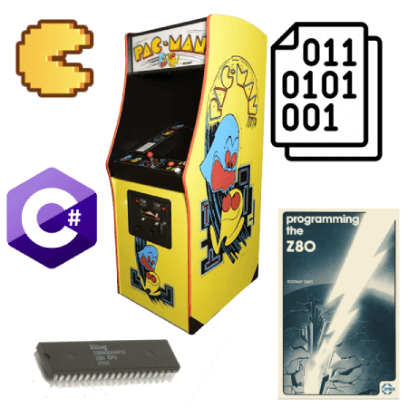
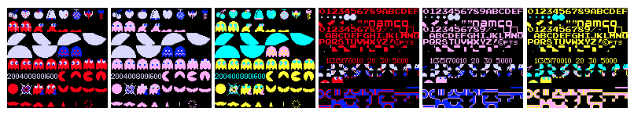
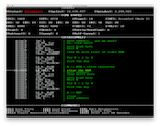
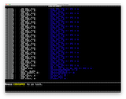

= Pac-Man Emulator
:lang: en

[[vlb1overlay]]

[[vlb1lightbox]]
[width="100%",cols="34%,33%,33%",]
|===
| | a|
[[vlb1close]]
link:javascript:void(0);[]

| a|
[[vlb1imageContainerMain]]
[[vlb1imageContainer]]
[[vlb1loading]]
link:javascript:void(0);[loading]

http://justin-credible.net/[Justin-Credible.net]

link:javascript:void(0);[]link:javascript:void(0);[]

[[vlb1imageDataContainer]]
[[vlb1imageData]]
[[vlb1imageDetails]]
[[vlb1caption]]

[#vlb1numberDisplay]####[#vlb1detailsNav]##link:javascript:void(0);[]link:javascript:void(0);[]link:javascript:void(0);[]##

|

| a|
[[vlb1shadow]]

|
|===

http://www.justin-credible.net/[Justin Unterreiner]

[.nav-toggle-button .collapsed]# [.sr-only]#Toggle navigation# __ #

[[main-menu]]
* http://www.justin-credible.net/[Home]
* http://www.justin-credible.net/projects/[Projects]
* http://www.justin-credible.net/arcade/[Arcade]
* http://www.justin-credible.net/experience/[Experience]

=== Pac-Man Emulator

[.author]#By https://www.justin-credible.net/author/justin/[Justin
Unterreiner]# • [.date]#August 24, 2020#

Once I finished up my Intel 8080 CPU core for my
https://www.justin-credible.net/2020/03/31/space-invaders-emulator/[Space
Invaders emulator], I wanted to move onto something a bit more
challenging. I knew that the Zilog Z80 CPU was a "cousin" to the 8080;
it was largely backwards compatible with the 8080, but also contained a
superset of instructions. If I chose to emulate a Z80-based system, I
would be able to reuse a large amount of my 8080 core's code.

I looked around for other systems that used the Z80, and there is no
shortage!

* Home computers: ZX Spectrum, TRS-80, MSX, Amstrad CPC
* Handhelds: Nintendo Gameboy, Sega GameGear
* Arcades: Pac-Man, Rally X, Dig Dug, Galaga

This was great news; if I built a Z80 emulation core, I could then reuse
it for other projects! I decided to start with something simple and well
documented: Pac-Man. An additional bonus was that with minor changes, I
would also be able to emulate Ms. Pac-Man; all Ms. Pac-Man boards are
just Pac-Man boards with a daughterboard installed to modify the
original CPU behavior and swap/patch certain ROMs. The
https://www.polygon.com/2016/3/25/11287572/ms-pac-man-story[story of Ms.
Pac-Man] it totally worth reading about.

.My emulator running Pac-Man, Ms. Pac-Man, and a homebrew ROM that generates the effect from The Matrix.
image::./index_files/showcase.gif[My emulator running Pac-Man, Ms.
Pac-Man, and a homebrew ROM that generates the effect from The Matrix.]

[[zilogz80]]
=== Zilog Z80

I started with a copy of my Space Invaders repository and began
stripping out the Space Invaders-specific code. I then got to work
implementing the additional instructions present in the Z80.
http://clrhome.org/table/[This site] offers an interactive and
searchable list of opcodes, which was extremely useful. Also, the 2016
version of the
http://www.zilog.com/force_download.php?filepath=YUhSMGNEb3ZMM2QzZHk1NmFXeHZaeTVqYjIwdlpHOWpjeTk2T0RBdlZVMHdNRGd3TG5Ca1pnPT0=[Z80
CPU User Manual] provided a lot of details.

After implementing the additional instructions, it was time to go back
and fix areas of the code that I hadn't completely finished for Space
Invaders. I hadn't implemented the auxiliary carry flag and a few other
opcodes that Space Invaders didn't use.
https://retrocomputing.stackexchange.com/a/1612[This StackOverflow post]
was a great starting point for identifying the differences between the
8080 and Z80.

This part of the project took the longest; I had to rework all the code
that set the flags register. As in the last project, writing unit tests
along the way was integral to success.

Also like last time, I was able to verify my Z80 implementation by using
a diagnostics program written for the original CPU. The
http://mdfs.net/Software/Z80/Exerciser/[Z80 Instruction Exerciser]
executes every opcode and then compares checksums of memory to checksums
generated on actual hardware. Very cool!

I ended up with over 8000 unit test cases, though many of these were
permutations of single tests using every register and/or several
different memory location offsets.

=== Video

The Space Invaders video hardware was dead simple; because the screen
was black and white, there was one bit per pixel, and the pixel was
either on or off. Memory held the array of pixels, and I just needed to
draw them using the SDL library.

There are downsides to this, however. Space Invaders included a
dedicated bit shift hardware to make this faster.

Pac-Man is in color, of course, so its video hardware is a bit more
advanced. It uses tiles and sprites along with pre-defined color
palettes.
https://www.lomont.org/software/games/pacman/PacmanEmulation.pdf[Chris
Lomont's Pac-Man Emulation Guide] contains a ton of great information on
exactly how it works, so I won't recap it all here.

Once I had written the code to draw the tiles, I needed to verify it,
but I couldn't yet boot the game. Because the tile drawing code just
reads the tile number and palette numbers out of memory, I fired up MAME
and got a dump of Pac-Man at a couple of points during the attract
screens. I then added this dump to my unit test and visually verified
that my code generated a bitmap that matched MAME.

I did something similar to test the sprite hardware; I simply hard-coded
the X/Y coordinates and sprite and palette numbers and then ran my
render code via a unit test.

You can see the various test results
https://github.com/Justin-Credible/pac-man-emulator/tree/master/emulator.tests/ReferenceData[here].

=== Audio

At this point, I was pretty comfortable emulating a CPU and video
hardware, but had no idea how audio worked.

For Space Invaders, I opted not to emulate the analog audio hardware,
and instead just played back pre-recorded wav files. This worked fine
because the audio in Space Invaders is pretty simple.

In Pac-Man, however, the sound is much richer. There are three audio
channels for sound effects, and several different music tracks that play
during the intermission sequences.

Again,
https://www.lomont.org/software/games/pacman/PacmanEmulation.pdf[Chris
Lomont's guide] was a key resource. However, although I was able to
easily implement the behavior of the audio hardware itself, I was at a
loss on how to use the audio sample binary data I had to actually play
back the audio.

Some Googling eventually led to the article
https://nicolasallemand.com/2019/12/12/let-there-be-sound/[Let there be
sound], which begins with the absolute basics and eventually ends with
code showing how to play a simple sine wave.

After some trial and error and a lot of static from the speakers, I was
finally greeted with a deafening BOOWHAP coin-up sound scared me out of
my seat. Pro tip: turn down your speakers before you try out new audio
code. 🤣

=== Debugger

I added upon the interactive debugger from the Space Invaders codebase,
which was previously implemented in text-mode inside of a standard
console window (e.g. `Console.WriteLine` and `Console.ReadKey`). I
wanted to make the debugger render inside of an SDL window so that I
could have more control over the layout. For example, text can now be
rendered in color and single pixels can be plotted. This also makes it
easier to implement interactive UI elements, which can be seen in the
save and load state menu where the arrows can be used instead of being
required to type a full file path.

https://www.justin-credible.net/content/images/2020/11/debugger-main.png[]
https://www.justin-credible.net/content/images/2020/11/debugger-load-state.png[]
https://www.justin-credible.net/content/images/2020/11/debugger-breakpoints.png[]
https://www.justin-credible.net/content/images/2020/11/debugger-history.png[]

[[bonusxboxport]]
=== Bonus: Xbox Port

I came back a few months later and decided to try and port my emulator
to a console. I already had the emulator up and running on Windows,
Linux, and macOS courtesy of the cross-platform
https://dotnet.microsoft.com/[.NET Core] runtime, C++#++, and SDL2. So
naturally this was a great fit for a port to the Xbox One via a UWP
application.

This led me down a bit of a side-adventure learning about how to get
SDL2 running on an Xbox One inside of a UWP app, which was quite
interesting. This led to me putting together a
https://github.com/Justin-Credible/xbox-uwp-sdl2-starter[starter project
template] for anyone else who wants to port their SDL2 application to
Xbox.

=== Results

This was an awesome project! It was slightly more challenging than Space
Invaders, and taught me the basics of playing audio. With some minor
modifications, I was able to run Ms. Pac-Man and
http://umlautllama.com/projects/pacdocs/[homebrew ROMs]. With a little
more work, I should be able to run other games that run on very similar
hardware, such as Rally X and Pengo. And now that I have a fully
functioning Z80 core, I can continue on to something more advanced, like
the Gameboy!

You can find more details on
https://github.com/Justin-Credible/pac-man-emulator[GitHub]. The readme
contains a
https://github.com/Justin-Credible/pac-man-emulator#resources[resources]
section with some links to recommended reading.

==== http://github.com/Justin-Credible[Justin-Credible]/http://github.com/Justin-Credible/pac-man-emulator[pac-man-emulator]

http://github.com/Justin-Credible/pac-man-emulator/watchers[47]http://github.com/Justin-Credible/pac-man-emulator/network/members[9]

🕹 An emulator for the Pac-Man arcade machine (Zilog Z80 CPU) for
Win/Mac/++*++nix and Xbox One. —
http://github.com/Justin-Credible/pac-man-emulator#readme[Read More]

https://www.justin-credible.net/2020/08/24/pac-man-emulator/

Latest commit to the *master* branch on 2-24-2026

http://github.com/Justin-Credible/pac-man-emulator/zipball/master[Download
as zip]

__
https://www.justin-credible.net/tag/emulators/[Emulators],https://www.justin-credible.net/tag/software-development/[Software
Development],https://www.justin-credible.net/tag/gaming/[Gaming]

* https://bsky.app/intent/compose?text=Pac-Man%20Emulator+http://www.justin-credible.net/2020/08/24/pac-man-emulator/[_image:./index_files/bluesky.svg[./index++_++files/bluesky]_]
* https://www.facebook.com/sharer/sharer.php?u=http://www.justin-credible.net/2020/08/24/pac-man-emulator/[__]
* link:javascript:void((function()%7Bvar%20e=document.createElement('script');e.setAttribute('type','text/javascript');e.setAttribute('charset','UTF-8');e.setAttribute('src','//assets.pinterest.com/js/pinmarklet.js?r='+Math.random()*99999999);document.body.appendChild(e)%7D)());[__]
* https://www.linkedin.com/shareArticle?mini=true%26url=http://www.justin-credible.net/2020/08/24/pac-man-emulator/%26source=http://www.justin-credible.net[__]

https://www.justin-credible.net/author/justin/[image:./index_files/d822557c426b50ed688d74cb203af356.jpeg[Author
image]]

About https://www.justin-credible.net/author/justin/[Justin Unterreiner]

[.loaction]#____Northern California#

A software geek who is into IoT devices, gaming, and Arcade restoration.

https://www.justin-credible.net/2020/12/04/xbox-uwp-sdl2-starter-project/[__
Previous Post : Xbox UWP SDL2 Starter Project]  
https://www.justin-credible.net/2020/08/16/booting-up-the-quake-arcade-tournament-edition-hard-drive/[Next
Post : Booting up the Quake Arcade Tournament Edition hard drive __]

===== Contact

* https://github.com/Justin-Credible[__]
* https://bsky.app/profile/justin-credible.net[_image:./index_files/bluesky.svg[./index++_++files/bluesky]_]
* https://www.linkedin.com/pub/justin-unterreiner/92/3aa/1b3[__]
* mailto:justin.unterreiner@gmail.com[__]
* http://www.justin-credible.net/rss/[__]

===== Justin's Arcade

* https://www.justin-credible.net/arcade[__]
* https://www.youtube.com/channel/UC6v-b_CQeSwZQXxXEWgCikg[__]
* https://www.instagram.com/justins_arcade/[__]
* http://www.arcade-museum.com/members/member_detail.php?member_id=452252[__]

===== Recent Posts

https://www.justin-credible.net/2024/07/07/donkey-kong-junior-conversion/[Donkey
Kong Junior conversion]

July 7, 2024

https://www.justin-credible.net/2024/04/14/super-mario-bros-pinball-mods/[Super
Mario Bros. Pinball Mods]

April 14, 2024

https://www.justin-credible.net/2023/12/04/locking-in-typescript/[Locking
in TypeScript]

December 4, 2023

===== Tags

https://www.justin-credible.net/tag/cordova/[Cordova]
https://www.justin-credible.net/tag/arcade-restoration/[Arcade
Restoration] https://www.justin-credible.net/tag/home-networking/[Home
Networking]
https://www.justin-credible.net/tag/software-development/[Software
Development]
https://www.justin-credible.net/tag/the-internet-of-things/[The Internet
of Things] https://www.justin-credible.net/tag/home-automation/[Home
Automation] https://www.justin-credible.net/tag/gaming/[Gaming]
https://www.justin-credible.net/tag/emulators/[Emulators]
https://www.justin-credible.net/tag/capacitor/[Capacitor]
https://www.justin-credible.net/tag/arcade-misc/[Arcade Miscellaneous]
https://www.justin-credible.net/tag/game-dev/[Game Dev]
https://www.justin-credible.net/tag/pinball/[Pinball]

===== Gaming

https://www.grouvee.com/user/JustinCredible/shelves/62935-playing/?utm_medium=api&utm_source=shelf_widget[Currently
Playing:]

[[grouvee_widget_62935_sidebar]]
=== https://www.grouvee.com/user/11976-JustinCredible/shelves/62935-playing/?utm_medium=api&utm_source=shelf_widget[JustinCredible's Playing Grouvee shelf]

https://www.grouvee.com/games/196497-arc-raiders/?utm_medium=api&utm_source=shelf_widget[image:./index_files/295bc173ba0516d570b17bd21d124761.jpg[ARC
Raiders]]

https://www.grouvee.com/games/190842-hades-ii/?utm_medium=api&utm_source=shelf_widget[image:./index_files/62f0fbe954edec8a55c82dfbfaef808d.jpg[Hades
II]]

https://www.grouvee.com/user/JustinCredible/shelves/62983-all-time-favorites[View
All-Time Favorites]

===== Recent Posts

https://www.justin-credible.net/2024/07/07/donkey-kong-junior-conversion/[Donkey
Kong Junior conversion]

July 7, 2024

https://www.justin-credible.net/2024/04/14/super-mario-bros-pinball-mods/[Super
Mario Bros. Pinball Mods]

April 14, 2024

https://www.justin-credible.net/2023/12/04/locking-in-typescript/[Locking
in TypeScript]

December 4, 2023

===== Tags

https://www.justin-credible.net/tag/cordova/[Cordova]
https://www.justin-credible.net/tag/arcade-restoration/[Arcade
Restoration] https://www.justin-credible.net/tag/home-networking/[Home
Networking]
https://www.justin-credible.net/tag/software-development/[Software
Development]
https://www.justin-credible.net/tag/the-internet-of-things/[The Internet
of Things] https://www.justin-credible.net/tag/home-automation/[Home
Automation] https://www.justin-credible.net/tag/gaming/[Gaming]
https://www.justin-credible.net/tag/emulators/[Emulators]
https://www.justin-credible.net/tag/capacitor/[Capacitor]
https://www.justin-credible.net/tag/arcade-misc/[Arcade Miscellaneous]
https://www.justin-credible.net/tag/game-dev/[Game Dev]
https://www.justin-credible.net/tag/pinball/[Pinball]

===== Gaming

https://www.grouvee.com/user/JustinCredible/shelves/62935-playing/?utm_medium=api&utm_source=shelf_widget[Currently
Playing:]

[[grouvee_widget_62935_footer]]
=== https://www.grouvee.com/user/11976-JustinCredible/shelves/62935-playing/?utm_medium=api&utm_source=shelf_widget[JustinCredible's Playing Grouvee shelf]

https://www.grouvee.com/games/196497-arc-raiders/?utm_medium=api&utm_source=shelf_widget[image:./index_files/295bc173ba0516d570b17bd21d124761.jpg[ARC
Raiders]]

https://www.grouvee.com/games/190842-hades-ii/?utm_medium=api&utm_source=shelf_widget[image:./index_files/62f0fbe954edec8a55c82dfbfaef808d.jpg[Hades
II]]

https://www.grouvee.com/user/JustinCredible/shelves/62983-all-time-favorites[View
All-Time Favorites]

Copyright © 2026, http://www.justin-credible.net/[Justin Unterreiner].
All Right Reserved

https://www.justin-credible.net/2020/08/24/pac-man-emulator/#[__]

[[grouvee_widget_62935]]
=== https://www.grouvee.com/user/11976-JustinCredible/shelves/62935-playing/?utm_medium=api&utm_source=shelf_widget[JustinCredible's Playing Grouvee shelf]

https://www.grouvee.com/games/196497-arc-raiders/?utm_medium=api&utm_source=shelf_widget[image:./index_files/295bc173ba0516d570b17bd21d124761.jpg[ARC
Raiders]]

https://www.grouvee.com/games/190842-hades-ii/?utm_medium=api&utm_source=shelf_widget[image:./index_files/62f0fbe954edec8a55c82dfbfaef808d.jpg[Hades
II]]

[[pswp]]
