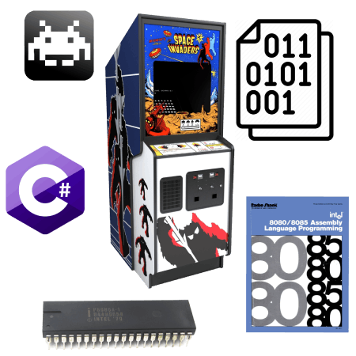
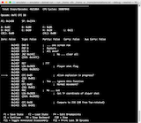

= Space Invaders Emulator
:lang: en

[[vlb1overlay]]

[[vlb1lightbox]]
[width="100%",cols="34%,33%,33%",]
|===
| | a|
[[vlb1close]]
link:javascript:void(0);[]

| a|
[[vlb1imageContainerMain]]
[[vlb1imageContainer]]
[[vlb1loading]]
link:javascript:void(0);[loading]

http://justin-credible.net/[Justin-Credible.net]

link:javascript:void(0);[]link:javascript:void(0);[]

[[vlb1imageDataContainer]]
[[vlb1imageData]]
[[vlb1imageDetails]]
[[vlb1caption]]

[#vlb1numberDisplay]####[#vlb1detailsNav]##link:javascript:void(0);[]link:javascript:void(0);[]link:javascript:void(0);[]##

|

| a|
[[vlb1shadow]]

|
|===

http://www.justin-credible.net/[Justin Unterreiner]

[.nav-toggle-button .collapsed]# [.sr-only]#Toggle navigation# __ #

[[main-menu]]
* http://www.justin-credible.net/[Home]
* http://www.justin-credible.net/projects/[Projects]
* http://www.justin-credible.net/arcade/[Arcade]
* http://www.justin-credible.net/experience/[Experience]

=== Space Invaders Emulator

[.author]#By https://www.justin-credible.net/author/justin/[Justin
Unterreiner]# • [.date]#March 31, 2020#

I really enjoyed the process of building my
https://www.justin-credible.net/2019/09/03/chip-8-emulator/[CHIP-8
emulator], so after I finished I immediately started looking for another
emulator project.

The general consensus on https://www.reddit.com/r/EmuDev/[r/emudev] and
the http://www.emutalk.net/forums/30-Emulator-Programming[EmuTalk
Forums] seemed to point to the 1978 arcade game: _Space Invaders_. This
was perfect for me since it also overlapped my other hobby: arcade
machine restoration.

The getting started phase went much quicker than my first emulator since
I was able to re-use several components from my CHIP-8's C++#++
codebase: the command line interface program, the SDL GUI program, and
the unit test runner. I did take some time to reorganize the project
structure.

____
TL;DR: Skip to the
https://www.justin-credible.net/2020/03/31/space-invaders-emulator/#results[Results
section] for a video clip and link to the source code.
____

[[intel8080cpu]]
== Intel 8080 CPU

In my CHIP-8 emulator I only had a single project which encompassed the
CLI program, GUI, and emulator. This led to tightly coupled modules.
While this was fine for a small emulator, I knew this wouldn't work for
something larger.

Space Invaders uses an https://en.wikipedia.org/wiki/Intel_8080[Intel
8080] CPU running at 2 MHz along with some of its own specific hardware.
I did all the work on the CPU core in its own module to keep it separate
from the rest of the game's hardware. This should allow me to re-use
much of my CPU core code for future emulation projects that use the
Intel 8080 or it's cousin the
https://en.wikipedia.org/wiki/Zilog_Z80[Zilog Z80].

____
An aside: One of my favorite parts of this project was checking out the
https://altairclone.com/downloads/manuals/8080%20Programmers%20Manual.pdf[Intel
8080 Assembly Language Programmers Manual]. This manual explains how
each opcode works at the byte level and was my main reference. This
manual was fascinating because it illustrates how CPUs in this era were
simple and understandable. Today's modern CPUs are so complex that even
if you write assembly language for them it is not what runs on the bare
metal (see: https://en.wikipedia.org/wiki/Intel_Microcode[microcode])
and they even run entire operating systems in their firmware (the
https://en.wikipedia.org/wiki/MINIX_3[MINIX] operating system is
embedded in Intel CPUs
https://en.wikipedia.org/wiki/Intel_Management_Engine#Hardware[Management
Engine] for example ).
____

One major difference from the CHIP-8 was that CPU speed and the number
of cycles executed was important. I needed to count the number of cycles
per instruction so that I could throttle the emulation loop to
approximately 2 MHz so the game would run at the correct speed.

Additionally, the Intel 8080 CPU has interrupts which can temporarily
pause CPU execution in order to temporarily run other opcodes before
resuming. Space Invaders fires two different interrupts at 60 Hz; once
when the CRT's electron beam is approximately half way down the screen
and the other when the beam is at the end (which is also known as
VBLANK). We can estimate when these interrupts should occur based on the
number of cycles executed.

[[audiovideoandshifthardware]]
== Audio, video, and shift hardware

Another interesting aspect was seeing how the Space Invaders PCB
connected the CPU to other pieces of hardware. The `IN` and `OUT`
instructions can be used to read and read bits from other "devices". In
this case the code "reads" the state of the buttons (pressed or not
pressed) and "writes" bits to tell the analog audio hardware when to
play sounds.

In this case I didn't attempt to emulate the analog audio hardware, and
up until recently even real emulators like MAME didn't either. From what
I understand it is computationally expensive to emulate analog hardware,
and simply playing back WAV samples when needed is close enough.

Graphics are handled by writing bits into a specific region of memory.
In order to place sprites, frequent bit shifting is needed.
Unfortunately the 8080 doesn't have opcodes for shifting, so Space
Invaders includes a dedicated shift register. This pieces of hardware is
accessible via the `IN` and `OUT` instructions as well.

[[verifyingopcodebehavior]]
=== Verifying Opcode Behavior

As with the CHIP-8 emulator, building unit tests for each opcode at the
same time as implementing the opcode was instrumental for success. It's
much easier to test each opcode in isolation than trying to track down
bugs when the entire game ROM is loaded and running.

While this saved a ton of time, it didn't catch 100% of the bugs of
course. Some of my unit tests made assumptions that weren't correct.
Also some of my unit tests were just wrong. I used two additional
approaches to verify my opcode behavior and track down bugs: integration
testing and adding an interactive debugger.

While unit tests verify the behavior of an individual opcode is correct,
bugs can still be possible when you have opcodes that interact. For
catching these scenarios I used an integration test by leveraging
https://github.com/begoon/i8080-core/blob/master/TEST.ASM[this] CPU
diagnostics program for the 8080/8085. By assembling and running this
program against my CPU I was able to verify it was _mostly_ correct.

The last few bugs I had to track down weren't caught by either my unit
tests or the integration test. There were a couple of crashes that
occurred consistently during the game's attract mode when the CPU
attempted to access memory locations far outside the game's 8K of
addressable memory space. Using my IDEs debugger was helpful in tracking
down how the illegal memory access occurred, it was nearly impossible to
see which combinations of opcodes and how they interacted that resulted
in the wrong memory address being calculated. At this pointed I needed a
more specialized debugging tool.

[[interactivedebugging]]
=== Interactive Debugging

I wrote an interactive debugger that would allow me to debug at a higher
level. Instead of stepping over lines of C++#++ code that implemented
the 8080 opcodes, I needed to step over individual opcodes and verify
register and memory values, just as if I was debugging an 8080 program.
So I incorporated the
https://k1.spdns.de/Develop/Projects/zasm/Distributions/[zasm
disassmebler] and built an interactive debugger.

https://www.justin-credible.net/content/images/2020/03/debugger.png[]

From here I could set breakpoints, inspect register and memory values,
single step over opcodes, save and restore CPU state, and view a history
of opcode execution. I also implemented a rewind feature so that once I
got to the problematic opcode I could them step backwards over opcodes
to see how I got there.

This allowed me to track down an issue with the interaction between two
opcodes (`CALL` and `RET`) which the unit tests and diagnostics program
did not catch.

=== Results

[#results]##

Space Invaders is an excellent second step after finishing a CHIP-8
emulator. It adds a few new concepts (timing, interrupts, external
hardware) but nothing too hard. I'm also hoping that I can re-use much
of my CPU core for my next project since the Intel 8080 is very close to
the Zilog Z80 (perhaps _Ms. Pac-Man_, _Galaga_, or even the _Gameboy_).

.A screen capture of my emulator running on macOS.
image::./index_files/gameplay.gif[A screen capture of my emulator
running on macOS.]

You can find more details on
https://github.com/Justin-Credible/space-invaders-emulator[GitHub]. The
readme contains a
https://github.com/Justin-Credible/space-invaders-emulator#resources[resources]
section with some links for recommended reading.

==== http://github.com/Justin-Credible[Justin-Credible]/http://github.com/Justin-Credible/space-invaders-emulator[space-invaders-emulator]

http://github.com/Justin-Credible/space-invaders-emulator/watchers[18]http://github.com/Justin-Credible/space-invaders-emulator/network/members[3]

👾 An emulator for the Space Invaders arcade machine (Intel 8080 CPU). —
http://github.com/Justin-Credible/space-invaders-emulator#readme[Read
More]

https://www.justin-credible.net/2020/03/31/space-invaders-emulator/

Latest commit to the *master* branch on 11-30-2022

http://github.com/Justin-Credible/space-invaders-emulator/zipball/master[Download
as zip]

__ https://www.justin-credible.net/tag/software-development/[Software
Development],https://www.justin-credible.net/tag/emulators/[Emulators],https://www.justin-credible.net/tag/gaming/[Gaming]

* https://bsky.app/intent/compose?text=Space%20Invaders%20Emulator+http://www.justin-credible.net/2020/03/31/space-invaders-emulator/[_image:./index_files/bluesky.svg[./index++_++files/bluesky]_]
* https://www.facebook.com/sharer/sharer.php?u=http://www.justin-credible.net/2020/03/31/space-invaders-emulator/[__]
* link:javascript:void((function()%7Bvar%20e=document.createElement('script');e.setAttribute('type','text/javascript');e.setAttribute('charset','UTF-8');e.setAttribute('src','//assets.pinterest.com/js/pinmarklet.js?r='+Math.random()*99999999);document.body.appendChild(e)%7D)());[__]
* https://www.linkedin.com/shareArticle?mini=true%26url=http://www.justin-credible.net/2020/03/31/space-invaders-emulator/%26source=http://www.justin-credible.net[__]

https://www.justin-credible.net/author/justin/[image:./index_files/d822557c426b50ed688d74cb203af356.jpeg[Author
image]]

About https://www.justin-credible.net/author/justin/[Justin Unterreiner]

[.loaction]#____Northern California#

A software geek who is into IoT devices, gaming, and Arcade restoration.

https://www.justin-credible.net/2020/05/17/galaxian-ac-to-dc-modification/[__
Previous Post : Galaxian: AC to DC Modification]  
https://www.justin-credible.net/2020/03/22/multi-game-cocktail-cabinet/[Next
Post : Multi-Game Cocktail Cabinet __]

===== Contact

* https://github.com/Justin-Credible[__]
* https://bsky.app/profile/justin-credible.net[_image:./index_files/bluesky.svg[./index++_++files/bluesky]_]
* https://www.linkedin.com/pub/justin-unterreiner/92/3aa/1b3[__]
* mailto:justin.unterreiner@gmail.com[__]
* http://www.justin-credible.net/rss/[__]

===== Justin's Arcade

* https://www.justin-credible.net/arcade[__]
* https://www.youtube.com/channel/UC6v-b_CQeSwZQXxXEWgCikg[__]
* https://www.instagram.com/justins_arcade/[__]
* http://www.arcade-museum.com/members/member_detail.php?member_id=452252[__]

===== Recent Posts

https://www.justin-credible.net/2024/07/07/donkey-kong-junior-conversion/[Donkey
Kong Junior conversion]

July 7, 2024

https://www.justin-credible.net/2024/04/14/super-mario-bros-pinball-mods/[Super
Mario Bros. Pinball Mods]

April 14, 2024

https://www.justin-credible.net/2023/12/04/locking-in-typescript/[Locking
in TypeScript]

December 4, 2023

===== Tags

https://www.justin-credible.net/tag/cordova/[Cordova]
https://www.justin-credible.net/tag/arcade-restoration/[Arcade
Restoration] https://www.justin-credible.net/tag/home-networking/[Home
Networking]
https://www.justin-credible.net/tag/software-development/[Software
Development]
https://www.justin-credible.net/tag/the-internet-of-things/[The Internet
of Things] https://www.justin-credible.net/tag/home-automation/[Home
Automation] https://www.justin-credible.net/tag/gaming/[Gaming]
https://www.justin-credible.net/tag/emulators/[Emulators]
https://www.justin-credible.net/tag/capacitor/[Capacitor]
https://www.justin-credible.net/tag/arcade-misc/[Arcade Miscellaneous]
https://www.justin-credible.net/tag/game-dev/[Game Dev]
https://www.justin-credible.net/tag/pinball/[Pinball]

===== Gaming

https://www.grouvee.com/user/JustinCredible/shelves/62935-playing/?utm_medium=api&utm_source=shelf_widget[Currently
Playing:]

[[grouvee_widget_62935_sidebar]]
=== https://www.grouvee.com/user/11976-JustinCredible/shelves/62935-playing/?utm_medium=api&utm_source=shelf_widget[JustinCredible's Playing Grouvee shelf]

https://www.grouvee.com/games/196497-arc-raiders/?utm_medium=api&utm_source=shelf_widget[image:./index_files/295bc173ba0516d570b17bd21d124761.jpg[ARC
Raiders]]

https://www.grouvee.com/games/190842-hades-ii/?utm_medium=api&utm_source=shelf_widget[image:./index_files/62f0fbe954edec8a55c82dfbfaef808d.jpg[Hades
II]]

https://www.grouvee.com/user/JustinCredible/shelves/62983-all-time-favorites[View
All-Time Favorites]

===== Recent Posts

https://www.justin-credible.net/2024/07/07/donkey-kong-junior-conversion/[Donkey
Kong Junior conversion]

July 7, 2024

https://www.justin-credible.net/2024/04/14/super-mario-bros-pinball-mods/[Super
Mario Bros. Pinball Mods]

April 14, 2024

https://www.justin-credible.net/2023/12/04/locking-in-typescript/[Locking
in TypeScript]

December 4, 2023

===== Tags

https://www.justin-credible.net/tag/cordova/[Cordova]
https://www.justin-credible.net/tag/arcade-restoration/[Arcade
Restoration] https://www.justin-credible.net/tag/home-networking/[Home
Networking]
https://www.justin-credible.net/tag/software-development/[Software
Development]
https://www.justin-credible.net/tag/the-internet-of-things/[The Internet
of Things] https://www.justin-credible.net/tag/home-automation/[Home
Automation] https://www.justin-credible.net/tag/gaming/[Gaming]
https://www.justin-credible.net/tag/emulators/[Emulators]
https://www.justin-credible.net/tag/capacitor/[Capacitor]
https://www.justin-credible.net/tag/arcade-misc/[Arcade Miscellaneous]
https://www.justin-credible.net/tag/game-dev/[Game Dev]
https://www.justin-credible.net/tag/pinball/[Pinball]

===== Gaming

https://www.grouvee.com/user/JustinCredible/shelves/62935-playing/?utm_medium=api&utm_source=shelf_widget[Currently
Playing:]

[[grouvee_widget_62935_footer]]
=== https://www.grouvee.com/user/11976-JustinCredible/shelves/62935-playing/?utm_medium=api&utm_source=shelf_widget[JustinCredible's Playing Grouvee shelf]

https://www.grouvee.com/games/196497-arc-raiders/?utm_medium=api&utm_source=shelf_widget[image:./index_files/295bc173ba0516d570b17bd21d124761.jpg[ARC
Raiders]]

https://www.grouvee.com/games/190842-hades-ii/?utm_medium=api&utm_source=shelf_widget[image:./index_files/62f0fbe954edec8a55c82dfbfaef808d.jpg[Hades
II]]

https://www.grouvee.com/user/JustinCredible/shelves/62983-all-time-favorites[View
All-Time Favorites]

Copyright © 2026, http://www.justin-credible.net/[Justin Unterreiner].
All Right Reserved

https://www.justin-credible.net/2020/03/31/space-invaders-emulator/#[__]

[[grouvee_widget_62935]]
=== https://www.grouvee.com/user/11976-JustinCredible/shelves/62935-playing/?utm_medium=api&utm_source=shelf_widget[JustinCredible's Playing Grouvee shelf]

https://www.grouvee.com/games/196497-arc-raiders/?utm_medium=api&utm_source=shelf_widget[image:./index_files/295bc173ba0516d570b17bd21d124761.jpg[ARC
Raiders]]

https://www.grouvee.com/games/190842-hades-ii/?utm_medium=api&utm_source=shelf_widget[image:./index_files/62f0fbe954edec8a55c82dfbfaef808d.jpg[Hades
II]]

[[pswp]]
