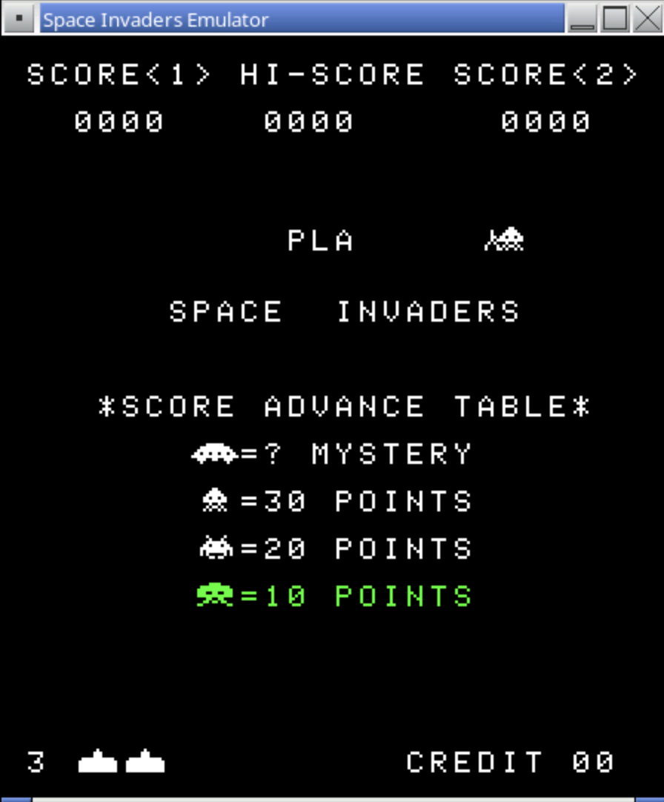

= Space Invaders Emulator
:toc:
:sectnums: 
ifndef::env-github[:icons: font]
:note-caption: :paperclip:
:important-caption: :exclamation:
:warning-caption: :warning:

[IMPORTANT]
====
The commit history of this branch is volatile. +
Rebasing and force pushing happens at will. +
The commits in this branch mostly collect changes with a narrow scope. +
They rarely document code evolution. +
The history may be rewritten without notice.
====

== Space Invaders Emulator

=== GitHub

Source::

https://github.com/Justin-Credible/space-invaders-emulator

Fork::
https://github.com/hghpublic/Justin-Credible-space-invaders-emulator

=== Screenshot

=== Build & Run

[source, bash]
----
./build.sh
./run.sh
----

== dotnet

=== dotnet command

https://learn.microsoft.com/en-us/dotnet/core/tools/dotnet

----
$ dotnet emulator/bin/Debug/net9.0/emulator.dll
 siemu 1.0.0+4c073ff2fbc9b4879f98f52d1dc793e211123b16

Usage: siemu [options] [command]

Options:
  -?|-h|--help  Show help information
  -v|--version  Show version information

Commands:
  run  Runs the emulator using the given ROM file.

Use "siemu [command] --help" for more information about a command.

$ dotnet emulator/bin/Debug/net9.0/emulator.dll run /workspaces/Justin-Credible-space-invaders-emulator/roms
----

=== Packages

https://www.nuget.org/

----
$ dotnet package search <package-name>
----

=== Introduction to C# - interactive tutorial

https://learn.microsoft.com/en-us/dotnet/csharp/tour-of-csharp/tutorials/hello-world

=== How to check that .NET is already installed

https://learn.microsoft.com/en-us/dotnet/core/install/how-to-detect-installed-versions

----
dotnet --list-sdks

$ dotnet --list-sdks
9.0.306 [/usr/share/dotnet/sdk]

dotnet --list-runtimes

$ dotnet --list-runtimes

Microsoft.AspNetCore.App 9.0.10 [/usr/share/dotnet/shared/Microsoft.AspNetCore.App]
Microsoft.NETCore.App 9.0.10 [/usr/share/dotnet/shared/Microsoft.NETCore.App]
----

=== How to: Determine which .NET Framework versions are installed

https://learn.microsoft.com/en-us/dotnet/framework/install/how-to-determine-which-versions-are-installed

=== dotnet run

----
$ cd emulator
$ dotnet run -- run --help

Usage: siemu run [arguments] [options]

Arguments:
  [ROM path]  The path to a directory containing the Space Invaders ROM set to load.

Options:
  -?|-h|--help          Show help information
  -sfx|--sound-effects  The path to a directory containing the WAV sound effects to be used.
  -ss|--starting-ships  Specify the number of ships the player starts with; 3 (default), 4, 5, or 6.
  -es|--extra-ship      Specify the number points needed to get an extra ship; 1000 (default) or 1500.
  -l|--load-state       Loads an emulator save state from the given path.
  -d|--debug            Run in debug mode; enables internal statistics and logs useful when debugging.
  -b|--break            Used with debug, will break at the given address and allow single stepping opcode execution (e.g. --break 0x0248)
  -r|--rewind           Used with debug, allows for single stepping in reverse to rewind opcode execution.
  -a|--annotations      Used with debug, a path to a text file containing memory address annotations for interactive debugging (line format: 0x1234 .... ; Annotation)

----

=== dotnet build

----
$ dotnet build
Restore complete (0.4s)
  intel8080 succeeded (0.1s) → intel8080/bin/Debug/net9.0/intel8080.dll
  disassembler succeeded (0.1s) → disassembler/bin/Debug/net9.0/disassembler.dll
  intel8080.tests succeeded (0.2s) → intel8080.tests/bin/Debug/net9.0/intel8080.tests.dll
  emulator succeeded with 2 warning(s) (0.2s) → emulator/bin/Debug/net9.0/emulator.dll
    /workspaces/Justin-Credible-space-invaders-emulator/emulator/GUI/GUI.cs(121,21): warning CS0472: The result of the expression is always 'false' since a value of type 'nint' is never equal to 'null' of type 'nint?'
    /workspaces/Justin-Credible-space-invaders-emulator/emulator/SpaceInvaders/SpaceInvaders.cs(475,17): warning CA2200: Re-throwing caught exception changes stack information (https://learn.microsoft.com/dotnet/fundamentals/code-analysis/quality-rules/ca2200)
  emulator.tests succeeded (0.1s) → emulator.tests/bin/Debug/net9.0/emulator.tests.dll

Build succeeded with 2 warning(s) in 1.1s
----

=== Microsoft.NET.Test.Sdk 18.0.0

https://www.nuget.org/packages/microsoft.net.test.sdk

----
dotnet add package Microsoft.NET.Test.Sdk --version 18.0.0
----

==== MSTest SDK overview

https://learn.microsoft.com/en-us/dotnet/core/testing/unit-testing-mstest-sdk

=== xunit

https://www.nuget.org/packages/xunit

----
dotnet add package xunit --version 2.9.3
----

== SDL2-CS

https://www.nuget.org/packages/SDL2-CS

----
dotnet add package SDL2-CS --version 2.0.0
----

https://github.com/flibitijibibo/SDL2-CS

https://jsayers.dev/c-sharp-sdl-tutorial-part-1-setup/

----
$ dpkg -L libsdl2-ttf-2.0-0:arm64 

...

/usr/lib/aarch64-linux-gnu/libSDL2_ttf-2.0.so.0.2000.1

...

/usr/lib/aarch64-linux-gnu/libSDL2_ttf-2.0.so.0

$ cd emulator
$ cp /usr/lib/aarch64-linux-gnu/libSDL2-2.0.so libSDL2.so

$ cd emulator/bin/Debug/net9.0
$ cp /usr/lib/aarch64-linux-gnu/libSDL2-2.0.so.0 libSDL2.so
$ cp /usr/lib/aarch64-linux-gnu/libSDL2_mixer-2.0.so.0 libSDL2_mixer.so 
----

=== Dependencies

----
$ sudo apt install libsdl2-2.0-0 libsdl2-gfx-1.0-0 libsdl2-image-2.0-0 libsdl2-mixer-2.0-0 libsdl2-ttf-2.0-0
$ sudo apt install libsdl2-dev libsdl2-gfx-dev libsdl2-image-dev libsdl2-mixer-dev libsdl2-ttf-dev

----

=== Stash

==== SDL2-CS-Tutorial

https://github.com/JeremySayers/SDL2-CS-Tutorial

== Issues

----
Exception has occurred: CLR/System.Exception
An unhandled exception of type 'System.Exception' occurred in emulator.dll: 'Failure while opening SDL audio mixer. SDL Error: ALSA: Couldn't open audio device: No such file or directory'
   at JustinCredible.SIEmulator.GUI.InitializeAudio(Dictionary`2 soundEffectsFiles) in /workspaces/Justin-Credible-space-invaders-emulator/emulator/GUI/GUI.cs:line 104
   at JustinCredible.SIEmulator.Program.<>c__DisplayClass7_0.<Run>b__0() in /workspaces/Justin-Credible-space-invaders-emulator/emulator/Program.cs:line 103
   at McMaster.Extensions.CommandLineUtils.CommandLineApplication.Execute(String[] args)
   at JustinCredible.SIEmulator.Program.Main(String[] args) in /workspaces/Justin-Credible-space-invaders-emulator/emulator/Program.cs:line 60
----

